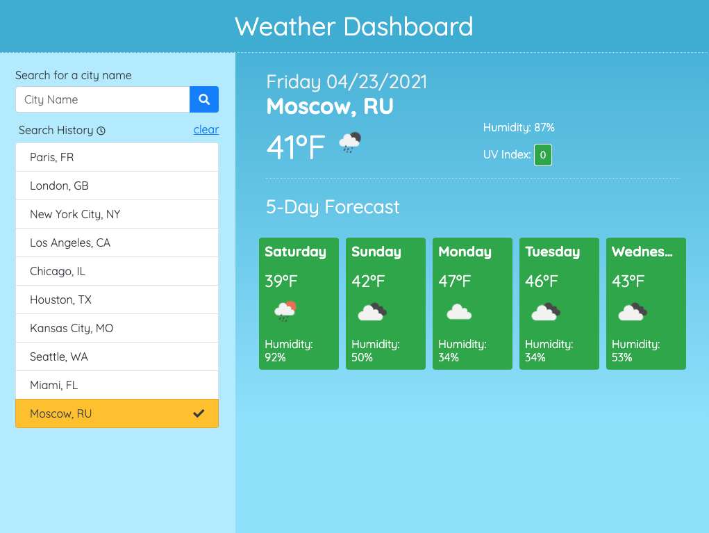
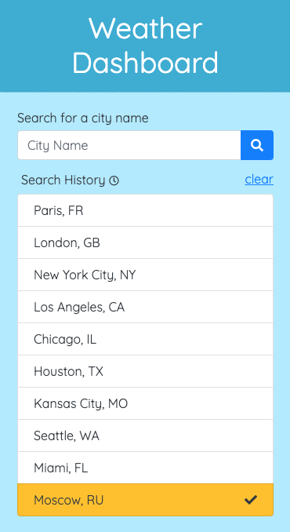

# weather-dashboard
Uses the OpenWeather API to retrieve weather data. Allows for the user to select from a list of cities or search for a new one and provides the user with a weather overview in that city. Uses JavaScript, Bootstrap, JSON and OpenWeather API.

Link to deployed application:
https://lindseyjeejan.github.io/weather-dashboard/

Desktop:

Mobile:

